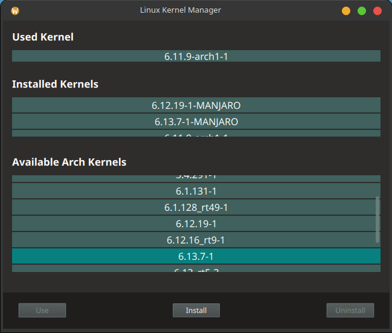

The goal is to create a simple Qt6-based GUI application for managing Linux kernels across major distributions.

Used technologies:
- C++ (backend)
- QML (frontend)

What works for now: 
- show the currently used kernel (only Arch and Arch-based distros)
- list all installed kernels (should work for all distros, but only tested on Manjaro)
- list all available and supported kernels (Manjaro and Arch-based distros)
- install kernels from Arch Linux Archive
- uninstall Arch and Manajro kernels
- update grub bootloader

Sneak peak: 

